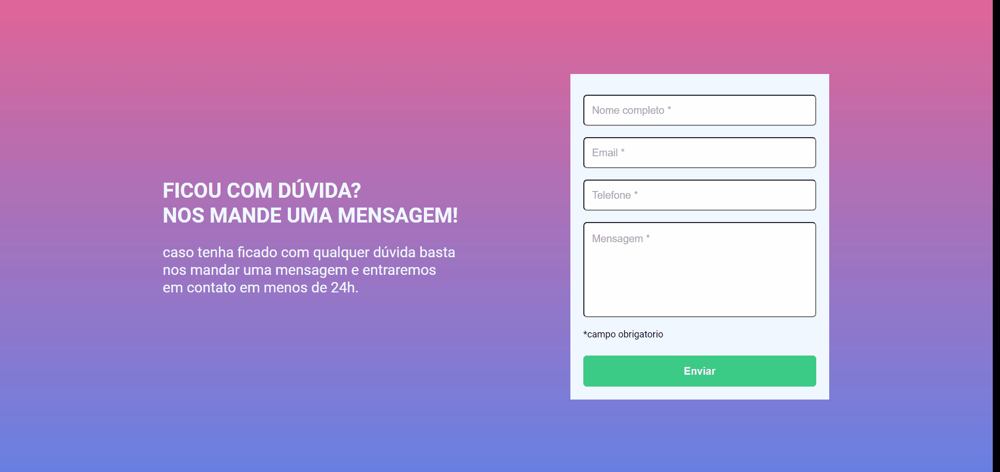

# Quest desafio JS + HTML + CSS / Formulário com validação

[]

## 🚀 Desafio

    Essa foi uma quest proposta pelo curso DevQuest do módulo JS Intermediário, com o objetivo de criar um formulário e aplicar validações. Quando o formulário estiver sem nenhum conteúdo nos inputs, ele informará que precisa ser preenchido. Quando houver conteúdo, mostrará que as informações são válidas.

## 🔖 Dificuldades

    As maiores dificuldades foi na hora de pensar como iria fazer a verificaçao dos inputs e de fazer mudar as cores usando dois eventos, o Submit para validar apos o envio e fazer a verificaçao usando o Change.  

## 🚀 O que eu aprendi
    Esse projeto foi um pouco desafiador para mim; tive um pouco de dificuldade em pensar na lógica de como iria enviar e validar de uma forma estática esse formulário. Pesquisei em várias documentações formas de aplicar isso e consegui, aprendendo um novo evento de 'addEventListener'. Estou satisfeito com o resultado. Foi bastante demorado para mim, mas consegui.
---

## 🔖 Construído com:
    HTML5
        -Marcação HTML5 semântico 
    CSS
        -Flex-box 
        -pseudo-clase
        -variáveis
    JS
        -Manipulação do DOM
        -Dois eventos do "addEventListener" = Submit e o Change
        -Condições IF e ELSE
        -ClassList
        -forEach
   
---

## 🚀 Tecnologias utilizadas

    - HTML
    - CSS
    - JS

---

    Desenvolvido por Emanuel Fortes